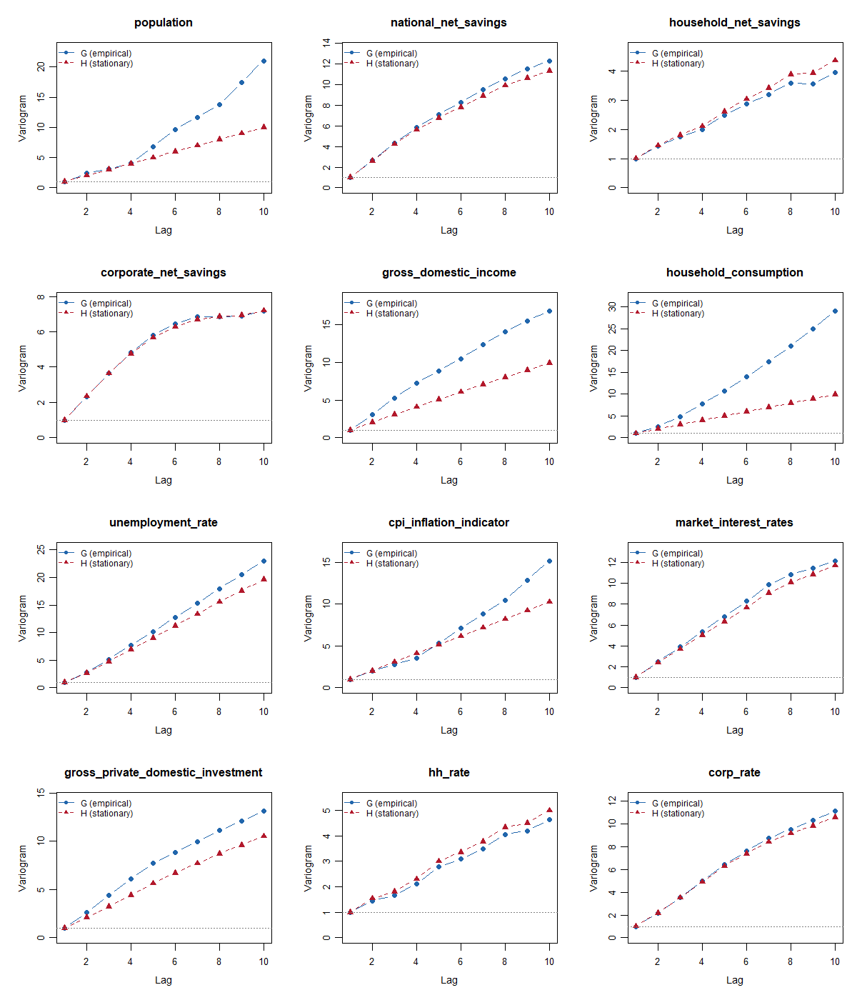
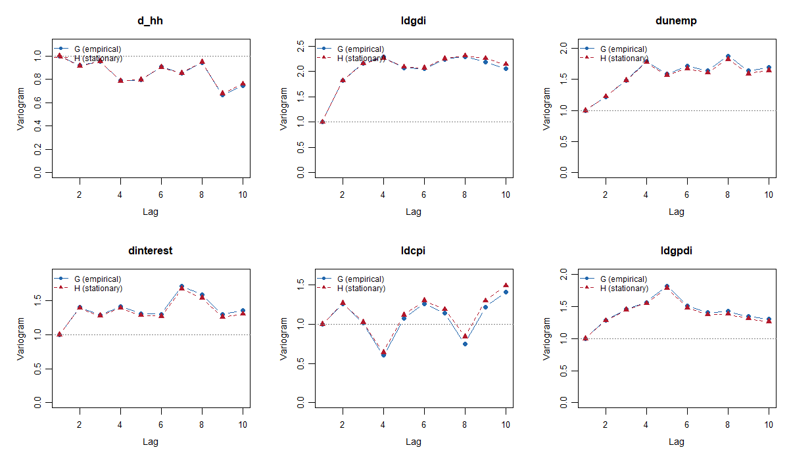

```{r setup}
knitr::opts_chunk$set(echo = TRUE, warning = FALSE, message = FALSE)
library(tidyverse)
library(lubridate)
library(forecast)
library(knitr)
library(tseries)
```

### Load the Harmonized Data and a First Glimpse
```{r data loading, include=TRUE}
macro_df <- read_csv("../data/macro_panel_wide_raw.csv", show_col_types = FALSE) |>
  mutate(quarterly_date = as.Date(quarterly_date)) |>
  mutate(household_consumption_pc = household_consumption / population * 1000000,
         gross_domestic_income_pc = gross_domestic_income / population * 1000000,
         gross_private_domestic_investment_pc = gross_private_domestic_investment / population * 1000000) |>
  arrange(quarterly_date)

glimpse(macro_df)
summary(macro_df)
```

```{r checking missing}
na_summary <- macro_df |>
  summarise(across(-quarterly_date, ~ sum(is.na(.)))) |>
  pivot_longer(
    cols = everything(),
    names_to = "series",
    values_to = "n_missing"
  ) |>
  arrange(desc(n_missing))

na_summary

# Remove the NA values at the end
macro_df <- macro_df |>
  filter(quarterly_date <= as.Date("2019-12-31"))
```
```{r distribution of key variable values}
#| fig.width: 8
#| fig.height: 8
key_vars <- macro_df |>
  select(-quarterly_date) |>
  pivot_longer(
    cols = everything(),
    names_to = "series",
    values_to = "value"
  )

# Adjust plot size for better readability
ggplot(key_vars, aes(x = value)) +
  geom_histogram(bins = 30, fill = "steelblue", color = "white") +
  facet_wrap(~ series, scales = "free", ncol = 2)+ 
  theme_minimal() +
  ggtitle("Distribution of key macro series values") +
  xlab("Value") +
  ylab("Frequency")
```


```{r Plot all series}
#| fig.width: 8
#| fig.height: 8
macro_long <- macro_df |>
  pivot_longer(
    cols = -quarterly_date,
    names_to = "series",
    values_to = "value"
  )

ggplot(macro_long, aes(x = quarterly_date, y = value)) +
  geom_line() +
  facet_wrap(~ series, scales = "free_y", ncol = 2) +
  theme_minimal() +
  labs(
    title = "All macro series over time",
    x = "Quarter",
    y = "Value"
  )
```

```{r EDA dataset}
eda_df <- macro_df |>
  select(
    quarterly_date,
    population,
    national_net_savings,
    household_net_savings,
    corporate_net_savings,
    gross_domestic_income,
    household_consumption,
    unemployment_rate,
    cpi_inflation_indicator,
    market_interest_rates,
    gross_private_domestic_investment
  ) |>
  rename(
    date = quarterly_date,
    pop = population,
    nat_save = national_net_savings,
    hh_save = household_net_savings,
    corp_save = corporate_net_savings,
    gdi = gross_domestic_income,
    cons = household_consumption,
    unemp = unemployment_rate,
    cpi = cpi_inflation_indicator,
    interest = market_interest_rates,
    gpdi = gross_private_domestic_investment
  ) |>
  mutate( # Standardize unit
    hh_rate = (hh_save / gdi) ,
    nat_rate = (nat_save / gdi)
  ) |>
  arrange(date)

glimpse(eda_df)
summary(eda_df)
```
```{r Save the EDA dataset for later use}
saveRDS(eda_df, file = "../output/eda_df_nodiff.rds")
```

```{r splitting into train and test}
# We keep the last 5 years (20 quarters) for testing, which means the training set includes data up to the end of 2014.
train_df <- eda_df |>
  filter(date <= as.Date("2009-12-31"))
test_df <- eda_df |>
  filter(date > as.Date("2009-12-31"))

saveRDS(train_df, file = "../output/train_df.rds")
saveRDS(test_df, file = "../output/test_df.rds")
```


```{r Compare the three net savings series}
#| fig.width: 8
#| fig.height: 4
# Reload train data to ensure we are using the same dataset as in the later modeling steps
eda_df <- readRDS("../output/train_df.rds")

savings_long <- eda_df |>
  select(date, nat_save, hh_save, corp_save) |>
  pivot_longer(
    cols = -date,
    names_to = "series",
    values_to = "value"
  )

ggplot(savings_long, aes(x = date, y = value, color = series)) +
  geom_line(linewidth = 0.9) +
  theme_minimal() +
  labs(
    title = "National, household, and corporate net savings",
    x = "Quarter",
    y = "Net savings",
    color = "Series"
  )
```

```{r Focus on household net savings}
ggplot(eda_df, aes(x = date, y = hh_save)) +
  geom_line(linewidth = 0.9) +
  theme_minimal() +
  labs(
    title = "Household net savings (response variable)",
    x = "Quarter",
    y = "Net savings"
  )
```
```{r auto.arima check for household net savings}
hh_ts <- ts(eda_df$hh_save, start = c(1977, 1), frequency = 4)

auto_arima_hh <- auto.arima(hh_ts)

summary(auto_arima_hh)
```
```{r auto.arima checks for consumption, GDI and GPDI}
cons_ts <- ts(eda_df$cons, start = c(1977, 1), frequency = 4)
gdi_ts <- ts(eda_df$gdi, start = c(1977, 1), frequency = 4)
gpdi_ts <- ts(eda_df$gpdi, start = c(1977, 1), frequency = 4)

auto_arima_cons <- auto.arima(cons_ts)
auto_arima_gdi <- auto.arima(gdi_ts)
auto_arima_gpdi <- auto.arima(gpdi_ts)

summary(auto_arima_cons)
summary(auto_arima_gdi)
summary(auto_arima_gpdi)
```
However, all three series are non-stationary in levels, which motivates the need for differencing or other transformations to achieve stationarity before modeling. 

### Transformations and Stationarity Checks

```{r Focused GDI EDA}
eda_df <- eda_df |>
  mutate(
    gdi_qoq = (gdi / lag(gdi) - 1),
    gdi_yoy = (gdi / lag(gdi, 4) - 1),
    ldgdi = log(gdi) - log(lag(gdi))
  )

summary(select(eda_df, gdi, gdi_qoq, gdi_yoy, ldgdi))
```

```{r GDI EDA}
p1 <- ggplot(eda_df, aes(x = date, y = gdi)) +
  geom_line(linewidth = 1) +
  theme_minimal() +
  labs(
    title = "Gross domestic income",
    x = "Quarter",
    y = "GDI"
  )

p2 <- ggplot(eda_df, aes(x = date, y = gdi_yoy*100)) +
  geom_line(linewidth = 1) +
  geom_hline(yintercept = 0, linetype = "dashed") +
  theme_minimal() +
  labs(
    title = "GDI year-over-year change (%)",
    x = "Quarter",
    y = "YoY % change"
  )

p3 <- ggplot(eda_df, aes(x = date, y = ldgdi*100)) +
  geom_line(linewidth = 1) +
  geom_hline(yintercept = 0, linetype = "dashed") +
  theme_minimal() +
  labs(
    title = "Log GDI quarter-over-quarter change (%)",
    x = "Quarter",
    y = "QoQ % change (log)"
  )

p1
p2
p3
```

```{r Simple transformations for the main outcome series}

eda_df <- eda_df |>
  mutate(
    dhh = hh_save - lag(hh_save),
    dcorp = corp_save - lag(corp_save),
    dnat = nat_save - lag(nat_save),
    dhh_rate = hh_rate - lag(hh_rate),
    dnat_rate = nat_rate - lag(nat_rate),
    dunemp = unemp - lag(unemp),
    dinterest = interest - lag(interest),
    # Use standard log differences for growth-style transformations.
    ldcons = log(cons) - log(lag(cons)),
    ldcpi = log(cpi) - log(lag(cpi)),
    ldgpdi = log(gpdi) - log(lag(gpdi))
  )

summary(select(
  eda_df,
  dhh,
  dcorp,
  dhh_rate,
  dnat_rate,
  dunemp,
  dinterest,
  ldcons,
  ldcpi,
  ldgpdi
))
```

```{r Plot the transformed difference series}
diff_long <- eda_df |>
  select(date, dhh) |>
  pivot_longer(
    cols = -date,
    names_to = "series",
    values_to = "value"
  )
ggplot(diff_long, aes(x = date, y = value)) +
  geom_line(linewidth = 0.9) +
  theme_minimal() +
  labs(
    title = "Change of household net savings",
    x = "Quarter",
    y = "Change in net savings"
  )

```

```{r Time-series diagnostics for household net savings}
hh_ts <- ts(
  eda_df$hh_save,
  start = c(1977, 1),
  frequency = 4
)

dhh_ts <- diff(hh_ts)

par(mfrow = c(2, 2))
plot(hh_ts, main = "Household net savings")
plot(dhh_ts, main = "First difference: household net savings")
acf(na.omit(dhh_ts), lag.max = 20, main = "ACF: diff household savings")
pacf(na.omit(dhh_ts), lag.max = 20, main = "PACF: diff household savings")
par(mfrow = c(1, 1))

adf.test(na.omit(dhh_ts))
```

- From the above, we see that the differenced household net savings appear stationary based on the ADF test and the visual diagnostics. 
- But they don't demonstrate strong autocorrelation, which suggests that they may be mostly driven by exogenous factors rather than strong internal dynamics.

```{r Lead-lag check of household savings and macro variables}
ccf(na.omit(eda_df$dhh), na.omit(eda_df$ldgdi),
    main = "hh savings vs log GDI")
```


```{r lead-lag-dhh-macro}
par(
  mfrow = c(2, 2),
  mar = c(5, 5, 3, 1),
  mgp = c(2, 0.8, 0),
  cex.main = 0.95,
  cex.lab = 0.9,
  cex.axis = 0.85
)

ccf(na.omit(eda_df$ldgdi), na.omit(eda_df$dhh),
    main = "log GDI vs hh savings")

ccf(na.omit(eda_df$dunemp), na.omit(eda_df$dhh),
    main = "Unemp vs hh savings")

ccf(na.omit(eda_df$ldcons), na.omit(eda_df$dhh),
    main = "Cons vs hh savings")

ccf(na.omit(eda_df$ldgpdi), na.omit(eda_df$dhh),
    main = "GPDI vs hh savings")

par(mfrow = c(1, 1))
```
From the above, we see the following:

- Household net savings show strong contemporaneous correlation with GDI, consumption, and CPI changes, as well as some leading correlation with unemployment changes.
- GPDI shows a clear leading relationship with household savings at lags 1–3, which motivates its use as an exogenous regressor in ARIMAX models.

```{r Simple scatterplot matrix}
pairs(
  eda_df |>
    select(hh_save, gdi, cons, unemp, cpi, interest) |>
    na.omit(),
  main = "Scatterplot matrix for key variables"
)
```

```{r Scatterplot matrix of differenced variables}
pairs(
  eda_df |>
    select(dhh, ldgdi, ldcons, dunemp, ldcpi, dinterest) |>
    na.omit(),
  main = "Scatterplot matrix for key variables after differencing"
)
```

```{r Save the final differenced dataset}
glimpse(eda_df)

saveRDS(eda_df, file = "../output/macro_df_diff.rds")
```

```{r variograms levels}

```

```{r variograms differenced}

```
- The plots indicate that most variables in levels are not stationary, because their empirical variogram G increases with lag and often departs from the theoretical stationary variogram H. 
- For many level variables, this increase is approximately linear rather than sharply curved, which suggests that a single difference is likely sufficient to achieve approximate stationarity. This pattern is especially obvious for variables such as national net savings, household net savings, corporate net savings, unemployment rate, market interest rates, household net saving rates, and corporate net saving rates, where G rises with lag and H does not fully overlap with it. 
- Some series, such as population, gross domestic income, household consumption, CPI, and gross private domestic investment, show stronger divergence between G and H, with growth in G that is steeper. This indicates these variables are even less stationary. In contrast, the differenced variables (`dhh`, `dcorp`, `ldgdi`, `dunemp`, `dinterest`, `ldcpi`, `ldgpdi`) and their lagged versions show overlapping G and H. This strongly suggests that these transformed series are approximately stationary. Overall, the variograms support the conclusion that first differencing is generally needed for the level variables, while there is little evidence that second differencing is required.