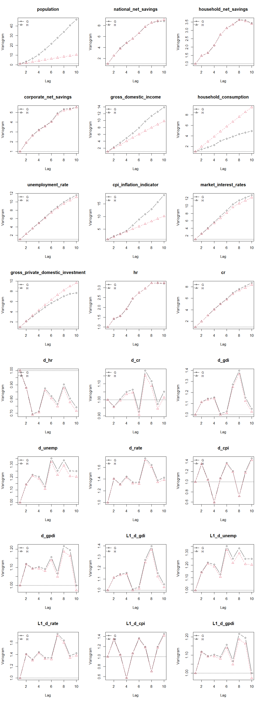

```{r setup}
knitr::opts_chunk$set(echo = TRUE, warning = FALSE, message = FALSE)
library(tidyverse)
library(lubridate)
library(forecast)
library(knitr)
library(tseries)
```

### Load the Harmonized Data and a First Glimpse
```{r data loading, include=TRUE}
macro_df <- read_csv("../data/macro_panel_wide_raw.csv", show_col_types = FALSE) |>
  mutate(quarterly_date = as.Date(quarterly_date)) |>
  mutate(household_consumption_pc = household_consumption / population * 1000000,
         gross_domestic_income_pc = gross_domestic_income / population * 1000000,
         gross_private_domestic_investment_pc = gross_private_domestic_investment / population * 1000000) |>
  arrange(quarterly_date)

glimpse(macro_df)
summary(macro_df)
```

```{r checking missing}
na_summary <- macro_df |>
  summarise(across(-quarterly_date, ~ sum(is.na(.)))) |>
  pivot_longer(
    cols = everything(),
    names_to = "series",
    values_to = "n_missing"
  ) |>
  arrange(desc(n_missing))

na_summary

# Remove the NA values at the end
macro_df <- macro_df |>
  filter(quarterly_date <= as.Date("2019-12-31"))
```
```{r distribution of key variable values}
#| fig.width: 8
#| fig.height: 8
key_vars <- macro_df |>
  select(-quarterly_date) |>
  pivot_longer(
    cols = everything(),
    names_to = "series",
    values_to = "value"
  )

# Adjust plot size for better readability
ggplot(key_vars, aes(x = value)) +
  geom_histogram(bins = 30, fill = "steelblue", color = "white") +
  facet_wrap(~ series, scales = "free", ncol = 2)+ 
  theme_minimal() +
  ggtitle("Distribution of key macro series values") +
  xlab("Value") +
  ylab("Frequency")
```


```{r Plot all series}
#| fig.width: 8
#| fig.height: 8
macro_long <- macro_df |>
  pivot_longer(
    cols = -quarterly_date,
    names_to = "series",
    values_to = "value"
  )

ggplot(macro_long, aes(x = quarterly_date, y = value)) +
  geom_line() +
  facet_wrap(~ series, scales = "free_y", ncol = 2) +
  theme_minimal() +
  labs(
    title = "All macro series over time",
    x = "Quarter",
    y = "Value"
  )
```

```{r EDA dataset}
eda_df <- macro_df |>
  select(
    quarterly_date,
    population,
    national_net_savings,
    household_net_savings,
    corporate_net_savings,
    gross_domestic_income,
    household_consumption,
    unemployment_rate,
    cpi_inflation_indicator,
    market_interest_rates,
    gross_private_domestic_investment
  ) |>
  rename(
    date = quarterly_date,
    pop = population,
    nat_save = national_net_savings,
    hh_save = household_net_savings,
    corp_save = corporate_net_savings,
    gdi = gross_domestic_income,
    cons = household_consumption,
    unemp = unemployment_rate,
    cpi = cpi_inflation_indicator,
    interest = market_interest_rates,
    gpdi = gross_private_domestic_investment
  ) |>
  mutate( # Standardize unit
    hh_rate = (hh_save / gdi) ,
    nat_rate = (nat_save / gdi)
  ) |>
  arrange(date)

glimpse(eda_df)
summary(eda_df)

```
```{r Save the EDA dataset for later use}
saveRDS(eda_df, file = "../output/eda_df_nodiff.rds")
```


```{r Compare the three net savings series}
#| fig.width: 8
#| fig.height: 4
savings_long <- eda_df |>
  select(date, nat_save, hh_save, corp_save) |>
  pivot_longer(
    cols = -date,
    names_to = "series",
    values_to = "value"
  )

ggplot(savings_long, aes(x = date, y = value, color = series)) +
  geom_line(linewidth = 0.9) +
  theme_minimal() +
  labs(
    title = "National, household, and corporate net savings",
    x = "Quarter",
    y = "Net savings",
    color = "Series"
  )
```

```{r Focus on household and corporate net savings}
main_response_long <- eda_df |>
  select(date, hh_save, corp_save) |>
  pivot_longer(
    cols = -date,
    names_to = "series",
    values_to = "value"
  )

ggplot(main_response_long, aes(x = date, y = value)) +
  geom_line(linewidth = 0.9) +
  facet_wrap(~ series, scales = "free_y", ncol = 1) +
  theme_minimal() +
  labs(
    title = "Main response series",
    x = "Quarter",
    y = "Net savings"
  )
```
```{r auto.arima check for main response series}
hh_ts <- ts(eda_df$hh_save, start = c(1977, 1), frequency = 4)
corp_ts <- ts(eda_df$corp_save, start = c(1977, 1), frequency = 4)

auto_arima_hh <- auto.arima(hh_ts)
auto_arima_corp <- auto.arima(corp_ts)

summary(auto_arima_hh)
summary(auto_arima_corp)
```
```{r auto.arima checks for the main response series in rate of GDI}
hh_rate_ts <- ts(eda_df$hh_rate, start = c(1977,1), frequency = 4)

auto_arima_hh_rate <- auto.arima(hh_rate_ts)

summary(auto_arima_hh_rate)
```
```{r auto.arima checks for consumption, GDI and GPDI}
cons_ts <- ts(eda_df$cons, start = c(1977, 1), frequency = 4)
gdi_ts <- ts(eda_df$gdi, start = c(1977, 1), frequency = 4)
gpdi_ts <- ts(eda_df$gpdi, start = c(1977, 1), frequency = 4)

auto_arima_cons <- auto.arima(cons_ts)
auto_arima_gdi <- auto.arima(gdi_ts)
auto_arima_gpdi <- auto.arima(gpdi_ts)

summary(auto_arima_cons)
summary(auto_arima_gdi)
summary(auto_arima_gpdi)
```
However, all three series are non-stationary in levels, which motivates the need for differencing or other transformations to achieve stationarity before modeling. 

### Transformations and Stationarity Checks

```{r Focused GDI EDA}
eda_df <- eda_df |>
  mutate(
    gdi_qoq = (gdi / lag(gdi) - 1),
    gdi_yoy = (gdi / lag(gdi, 4) - 1),
    ldgdi = log(gdi) - log(lag(gdi))
  )

summary(select(eda_df, gdi, gdi_qoq, gdi_yoy, ldgdi))
```

```{r GDI EDA}
p1 <- ggplot(eda_df, aes(x = date, y = gdi)) +
  geom_line(linewidth = 1) +
  theme_minimal() +
  labs(
    title = "Gross domestic income",
    x = "Quarter",
    y = "GDI"
  )

p2 <- ggplot(eda_df, aes(x = date, y = gdi_yoy*100)) +
  geom_line(linewidth = 1) +
  geom_hline(yintercept = 0, linetype = "dashed") +
  theme_minimal() +
  labs(
    title = "GDI year-over-year change (%)",
    x = "Quarter",
    y = "YoY % change"
  )

p3 <- ggplot(eda_df, aes(x = date, y = ldgdi*100)) +
  geom_line(linewidth = 1) +
  geom_hline(yintercept = 0, linetype = "dashed") +
  theme_minimal() +
  labs(
    title = "Log GDI change (%)",
    x = "Quarter",
    y = "YoY % change (log)"
  )

p1
p2
p3
```

```{r Simple transformations for the main outcome series}

eda_df <- eda_df |>
  mutate(
    dhh = hh_save - lag(hh_save),
    dcorp = corp_save - lag(corp_save),
    dnat = nat_save - lag(nat_save),
    dhh_rate = hh_rate - lag(hh_rate),
    dnat_rate = nat_rate - lag(nat_rate),
    dunemp = unemp - lag(unemp),
    dinterest = interest - lag(interest),
    ldcons = log1p(cons) - log1p(lag(cons)),
    ldcpi = log1p(cpi) - log1p(lag(cpi)),
    ldgpdi = log1p(gpdi) - log1p(lag(gpdi))
  )

summary(select(
  eda_df,
  dhh,
  dcorp,
  dhh_rate,
  dnat_rate,
  dunemp,
  dinterest,
  ldcons,
  ldcpi,
  ldgpdi
))
```

```{r Plot the transformed difference series}
diff_long <- eda_df |>
  select(date, dhh, dcorp) |>
  pivot_longer(
    cols = -date,
    names_to = "series",
    values_to = "value"
  )
ggplot(diff_long, aes(x = date, y = value)) +
  geom_line(linewidth = 0.9) +
  facet_wrap(~ series, scales = "free_y", ncol = 1) +
  theme_minimal() +
  labs(
    title = "Change of household and corporate net savings",
    x = "Quarter",
    y = "Change in net savings"
  )

```

```{r Plot transformed household and national series}
transformed_long <- eda_df |>
  select(date, dhh_rate, dnat_rate) |>
  pivot_longer(
    cols = -date,
    names_to = "series",
    values_to = "value"
  )

ggplot(transformed_long, aes(x = date, y = value*100)) +
  geom_line(linewidth = 0.9) +
  facet_wrap(~ series, scales = "free_y", ncol = 1) +
  theme_minimal() +
  labs(
    title = "Change of household and national net saving Rates",
    x = "Quarter",
    y = "Change"
  )
```

```{r Time-series diagnostics for household net savings}
hh_ts <- ts(
  eda_df$hh_save,
  start = c(1977, 1),
  frequency = 4
)

dhh_ts <- diff(hh_ts)

par(mfrow = c(2, 2))
plot(hh_ts, main = "Household net savings")
plot(dhh_ts, main = "First difference: household net savings")
acf(na.omit(dhh_ts), lag.max = 20, main = "ACF: diff household savings")
pacf(na.omit(dhh_ts), lag.max = 20, main = "PACF: diff household savings")
par(mfrow = c(1, 1))

adf.test(na.omit(dhh_ts))
```

```{r Benhmark diagnostics for corporate net savings}
corp_ts <- ts(
  eda_df$corp_save,
  start = c(1977, 1),
  frequency = 4
)

dcorp_ts <- diff(corp_ts)

par(mfrow = c(2, 2))
plot(corp_ts, main = "Corporate net savings")
plot(dcorp_ts, main = "First difference: corporate net savings")
acf(na.omit(dcorp_ts), lag.max = 20, main = "ACF: diff corporate savings")
pacf(na.omit(dcorp_ts), lag.max = 20, main = "PACF: diff corporate savings")
```

```{r Benchmark diagnostics for household saving rates}
hh_rate_ts <- ts(
  eda_df$hh_rate,
  start = c(1977, 1),
  frequency = 4
)

dhh_rate_ts <- diff(hh_rate_ts)

par(mfrow = c(2, 2))
plot(hh_rate_ts, main = "Household net saving rate")
plot(dhh_rate_ts, main = "First difference: household net saving rate")
acf(na.omit(dhh_rate_ts), lag.max = 20, main = "ACF: diff household saving rate")
pacf(na.omit(dhh_rate_ts), lag.max = 20, main = "PACF: diff household saving rate")
```

- From the above, we see that the differenced household and corporate net savings appear to be stationary based on the ADF test and the visual diagnostics. 
- But they don't demonstrate strong autocorrelation, which suggests that they may be mostly driven by exogenous factors rather than strong internal dynamics. 
- The national net saving rate shows similar patterns, but with slightly stronger autocorrelation at lag 1, which may reflect some persistence in the overall saving behavior of the economy.

```{r Lead-lag check of household and corporate net savings}
ccf(na.omit(eda_df$dhh), na.omit(eda_df$dcorp),
    main = "hh vs corp net savings")
```


```{r Lead-lag checks with GDI, unemployment, and consumptions}
options(repr.plot.width = 12, repr.plot.height = 8)
par(
  mfrow = c(2, 4),
  mar = c(5, 5, 3, 1),   # c(bottom, left, top, right)
  mgp = c(2, 0.8, 0),        # Pulls axis labels closer to the plot
  cex.main = 0.95,           # Scales down the main title
  cex.lab = 0.9,             # Scales down axis labels
  cex.axis = 0.85            # Scales down axis tick values
)

ccf(na.omit(eda_df$ldgdi), na.omit(eda_df$dhh),
    main = "log GDI vs hh savings")
ccf(na.omit(eda_df$ldgdi), na.omit(eda_df$dcorp),
    main = "log GDI vs corp savings")

ccf(na.omit(eda_df$dunemp), na.omit(eda_df$dhh),
    main = "Unemp vs hh savings")
ccf(na.omit(eda_df$dunemp), na.omit(eda_df$dcorp),
    main = "Unemp vs corp savings")

ccf(na.omit(eda_df$ldcons), na.omit(eda_df$dhh),
    main = "Cons vs hh savings")
ccf(na.omit(eda_df$ldcons), na.omit(eda_df$dcorp),
    main = "Cons vs corp savings")

ccf(na.omit(eda_df$ldgpdi), na.omit(eda_df$dhh),
    main = "GPDI vs hh savings")
ccf(na.omit(eda_df$ldgpdi), na.omit(eda_df$dcorp),
    main = "GPDI vs corp savings")

```


```{r Lead-lag checks with GDI, unemployment, and consumptions}
#| fig.width: 7
#| fig.height: 2.5
par(
  mfrow = c(1, 4)
)

ccf(na.omit(eda_df$ldgdi), na.omit(eda_df$dhh_rate),
    main = "log GDI vs hh saving rate")

ccf(na.omit(eda_df$dunemp), na.omit(eda_df$dhh_rate),
    main = "Unemp vs hh saving rate")

ccf(na.omit(eda_df$ldcons), na.omit(eda_df$dhh_rate),
    main = "Cons vs hh saving rate")

ccf(na.omit(eda_df$ldgpdi), na.omit(eda_df$dhh_rate),
    main = "GPDI vs hh saving rate")

par(mfrow = c(1, 1))
```
From the above, we see the following:

- Both househould and corporate net saving rates show strong contemporaneous correlation with GDI, consumption, and CPI changes, as well as some leading correlation with unemployment changes.
- Lead lag patterns between household and corporate net saving change is strong, with household net saving change leading corporate net saving change by 1-2 quarters, which is consistent with the idea that household savings behavior may influence corporate savings decisions through demand channels.

```{r Simple scatterplot matrix}
pairs(
  eda_df |>
    select(hh_save, corp_save, gdi, cons, unemp, cpi, interest) |>
    na.omit(),
  main = "Scatterplot matrix for key variables"
)
```

```{r Scatterplot matrix of differenced variables}
pairs(
  eda_df |>
    select(dhh, dcorp, ldgdi, ldcons, dunemp, ldcpi, dinterest) |>
    na.omit(),
  main = "Scatterplot matrix for key variables after differencing"
)
```
```{r Scatterplot matrix of differenced saving rates}
pairs(
  eda_df |>
    select(dhh_rate, ldgdi, ldcons, dunemp, ldcpi, dinterest) |>
    na.omit(),
  main = "Scatterplot matrix for key variables after differencing"
)
```

```{r Save the final differenced dataset}
glimpse(eda_df)

saveRDS(eda_df, file = "../output/macro_df_diff.rds")
```

```{r import variograms}

```
The plots indicate that most variables in levels are not stationary, because their empirical variogram G increases with lag and often departs from the theoretical stationary variogram H. For many level variables, this increase is approximately linear rather than sharply curved, which suggests that a single difference is likely sufficient to achieve approximate stationarity. This pattern is especially obvious for variables such as national net savings, household net savings, corporate net savings, unemployment rate, market interest rates, household net saving rates, and corporate net saving rates, where G rises with lag and H does not fully overlap with it. Some series, such as population, gross domestic income, household consumption, CPI, and gross private domestic investment, show stronger divergence between G and H, with growth in G that is steeper. This indicates these variables are even less stationary. In contrast, the differenced variables (d_hr, d_cr, d_gdi, d_unemp, d_rate, d_cpi, d_gpdi) and their lagged versions show overlapping G and H. This strongly suggests that these transformed series are approximately stationary. Overall, the variograms support the conclusion that first differencing is generally needed for the level variables, while there is little evidence that second differencing is required.